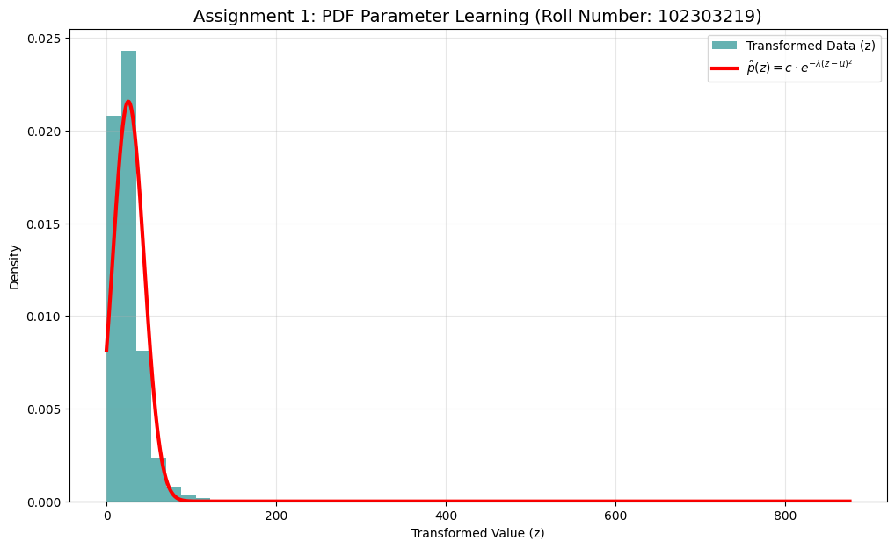

# Assignment: Learning Probability Density Functions using Roll-Number-Parameterized Non-Linear Model

**Name:** Khushnoor Kaur  
**Roll Number:** 102303219  
**Subject:** Predictive Analytics (UCS654)

## 1. Objective
The goal of this assignment is to learn the parameters of a specific Probability Density Function (PDF) for a transformed random variable. The transformation is based on a unique non-linear model parameterized by the university roll number.

## 2. Methodology

### A. Data Transformation
The feature $x$ (NO2 concentration) from the dataset was transformed into a new variable $z$ using the following equation:
$$z = x + a_r \cdot \sin(b_r \cdot x)$$

Where the parameters $a_r$ and $b_r$ are calculated dynamically based on the roll number:
* **$a_r$ Formula:** $0.05 \cdot (102303219 \mod 7)$
* **$b_r$ Formula:** $0.3 \cdot ((102303219 \mod 5) + 1)$

### B. PDF Parameter Estimation
After transforming the data, we assume the probability density function follows a Gaussian-like distribution given by:
$$\hat{p}(z) = c \cdot e^{-\lambda(z-\mu)^2}$$

To find the parameters $\lambda$, $\mu$, and $c$, we first calculate the standard statistical measures of the transformed data $z$:
1.  **Mean ($\mu$):** The average value of $z$.
2.  **Standard Deviation ($\sigma$):** The spread of $z$.

Then, we derive the target parameters using the equivalence to the Gaussian PDF formula:
* $\lambda = \frac{1}{2\sigma^2}$
* $c = \frac{1}{\sigma\sqrt{2\pi}}$

## 3. Results

### Transformation Parameters
| Parameter | Calculation | Value |
| :--- | :--- | :--- |
| **$a_r$** | $0.05 \times 4$ | **0.2** |
| **$b_r$** | $0.3 \times 5$ | **1.5** |

### Learned PDF Parameters
| Parameter | Value |
| :--- | :--- |
| **Mean ($\mu$)** | **25.8164** |
| **Lambda ($\lambda$)** | **0.00146** |
| **Constant ($c$)** | **0.02157** |

### Visual Output
The graph below compares the histogram of the actual transformed data $z$ with the learned theoretical PDF curve (Red Line).

## 4. Conclusion
The calculated parameters successfully fit the transformed data to the required probability density function. The visual overlap between the histogram and the red curve confirms that the derived values for $\mu$, $\lambda$, and $c$ accurately represent the distribution of the transformed variable $z$.
